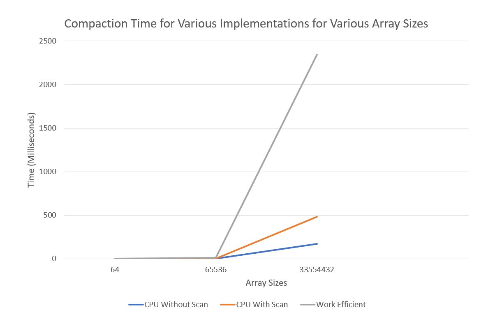
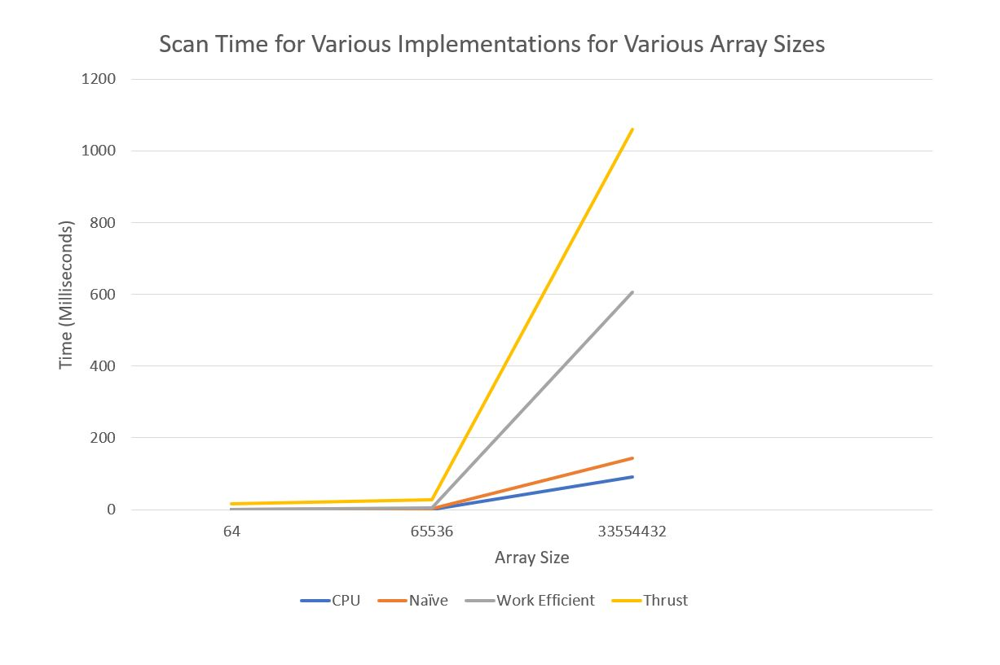

CUDA Stream Compaction
======================

**University of Pennsylvania, CIS 565: GPU Programming and Architecture, Project 2**

* Ishan Ranade
* Tested on personal computer: Gigabyte Aero 14, Windows 10, i7-7700HQ, GTX 1060

# Scan and Compaction

## Performance Graphs





## Test Results

#### Array size = 64
```
****************
** SCAN TESTS **
****************
    [  26  35   7   4  10   9  23  19  37  15  16  37  41 ...  23   0 ]
==== cpu scan, power-of-two ====
   elapsed time: 0.006929ms    (std::chrono Measured)
    [   0  26  61  68  72  82  91 114 133 170 185 201 238 ... 6108 6131 ]
==== cpu scan, non-power-of-two ====
   elapsed time: 0.00474ms    (std::chrono Measured)
    [   0  26  61  68  72  82  91 114 133 170 185 201 238 ... 6069 6090 ]
    passed
==== naive scan, power-of-two ====
   elapsed time: 0.676864ms    (CUDA Measured)
    passed
==== naive scan, non-power-of-two ====
   elapsed time: 0.342016ms    (CUDA Measured)
    passed
==== work-efficient scan, power-of-two ====
   elapsed time: 1.35987ms    (CUDA Measured)
    passed
==== work-efficient scan, non-power-of-two ====
   elapsed time: 1.09571ms    (CUDA Measured)
    passed
==== thrust scan, power-of-two ====
   elapsed time: 16.9236ms    (CUDA Measured)
    passed
==== thrust scan, non-power-of-two ====
   elapsed time: 3.34643ms    (CUDA Measured)
    passed

*****************************
** STREAM COMPACTION TESTS **
*****************************
    [   3   1   1   1   2   0   0   2   3   3   0   1   0 ...   1   0 ]
==== cpu compact without scan, power-of-two ====
   elapsed time: 0.001458ms    (std::chrono Measured)
    [   3   1   1   1   2   2   3   3   1   2   3   3   1 ...   2   1 ]
    passed
==== cpu compact without scan, non-power-of-two ====
   elapsed time: 0.018598ms    (std::chrono Measured)
    [   3   1   1   1   2   2   3   3   1   2   3   3   1 ...   3   2 ]
    passed
==== cpu compact with scan ====
   elapsed time: 0.006564ms    (std::chrono Measured)
    [   3   1   1   1   2   2   3   3   1   2   3   3   1 ...   2   1 ]
    passed
==== work-efficient compact, power-of-two ====
   elapsed time: 1.24522ms    (CUDA Measured)
    passed
==== work-efficient compact, non-power-of-two ====
   elapsed time: 1.38035ms    (CUDA Measured)
    passed
Press any key to continue . . .

```

#### Array size = 65536
```
****************
** SCAN TESTS **
****************
    [   4  12  16  28   0  38   0  11   2  40  25   0  28 ...  42   0 ]
==== cpu scan, power-of-two ====
   elapsed time: 0.264752ms    (std::chrono Measured)
    [   0   4  16  32  60  60  98  98 109 111 151 176 176 ... 1606322 1606364 ]
==== cpu scan, non-power-of-two ====
   elapsed time: 0.175772ms    (std::chrono Measured)
    [   0   4  16  32  60  60  98  98 109 111 151 176 176 ... 1606246 1606277 ]
    passed
==== naive scan, power-of-two ====
   elapsed time: 1.51245ms    (CUDA Measured)
    passed
==== naive scan, non-power-of-two ====
   elapsed time: 1.47968ms    (CUDA Measured)
    passed
==== work-efficient scan, power-of-two ====
   elapsed time: 5.45789ms    (CUDA Measured)
    passed
==== work-efficient scan, non-power-of-two ====
   elapsed time: 5.55315ms    (CUDA Measured)
    passed
==== thrust scan, power-of-two ====
   elapsed time: 27.2742ms    (CUDA Measured)
    passed
==== thrust scan, non-power-of-two ====
   elapsed time: 11.7524ms    (CUDA Measured)
    passed

*****************************
** STREAM COMPACTION TESTS **
*****************************
    [   2   0   2   2   0   2   0   1   0   0   3   2   0 ...   0   0 ]
==== cpu compact without scan, power-of-two ====
   elapsed time: 0.396034ms    (std::chrono Measured)
    [   2   2   2   2   1   3   2   1   3   1   3   3   3 ...   2   3 ]
    passed
==== cpu compact without scan, non-power-of-two ====
   elapsed time: 0.520386ms    (std::chrono Measured)
    [   2   2   2   2   1   3   2   1   3   1   3   3   3 ...   3   2 ]
    passed
==== cpu compact with scan ====
   elapsed time: 1.3048ms    (std::chrono Measured)
    [   2   2   2   2   1   3   2   1   3   1   3   3   3 ...   2   3 ]
    passed
==== work-efficient compact, power-of-two ====
   elapsed time: 9.05011ms    (CUDA Measured)
    passed
==== work-efficient compact, non-power-of-two ====
   elapsed time: 10.4632ms    (CUDA Measured)
    passed
Press any key to continue . . .
```

#### Array size = 33554432
```
****************
** SCAN TESTS **
****************
    [  34  21  39  39  17   7  27  41  25  44   5  38  27 ...  44   0 ]
==== cpu scan, power-of-two ====
   elapsed time: 91.0629ms    (std::chrono Measured)
    [   0  34  55  94 133 150 157 184 225 250 294 299 337 ... 821704663 821704707 ]
==== cpu scan, non-power-of-two ====
   elapsed time: 96.8149ms    (std::chrono Measured)
    [   0  34  55  94 133 150 157 184 225 250 294 299 337 ... 821704604 821704613 ]
    passed
==== naive scan, power-of-two ====
   elapsed time: 142.816ms    (CUDA Measured)
    passed
==== naive scan, non-power-of-two ====
   elapsed time: 130.053ms    (CUDA Measured)
    passed
==== work-efficient scan, power-of-two ====
   elapsed time: 606.905ms    (CUDA Measured)
    passed
==== work-efficient scan, non-power-of-two ====
   elapsed time: 598.48ms    (CUDA Measured)
    passed
==== thrust scan, power-of-two ====
   elapsed time: 1059.55ms    (CUDA Measured)
    passed
==== thrust scan, non-power-of-two ====
   elapsed time: 1052.12ms    (CUDA Measured)
    passed

*****************************
** STREAM COMPACTION TESTS **
*****************************
    [   0   2   2   1   0   1   3   1   1   2   3   2   1 ...   2   0 ]
==== cpu compact without scan, power-of-two ====
   elapsed time: 169.206ms    (std::chrono Measured)
    [   2   2   1   1   3   1   1   2   3   2   1   1   3 ...   1   2 ]
    passed
==== cpu compact without scan, non-power-of-two ====
   elapsed time: 169.446ms    (std::chrono Measured)
    [   2   2   1   1   3   1   1   2   3   2   1   1   3 ...   3   1 ]
    passed
==== cpu compact with scan ====
   elapsed time: 481.232ms    (std::chrono Measured)
    [   2   2   1   1   3   1   1   2   3   2   1   1   3 ...   1   2 ]
    passed
==== work-efficient compact, power-of-two ====
   elapsed time: 2345.71ms    (CUDA Measured)
    passed
==== work-efficient compact, non-power-of-two ====
   elapsed time: 4260.37ms    (CUDA Measured)
    passed
Press any key to continue . . .
```

## Discussion

One of the biggest performance hits for my work efficient implementation I believe is the bank conflicts that are occurring, which are drastically reducing its efficiency.  Another hit could be the mathematical operations that I am performing in my kernels, as I tended to repeat some calculations and did not save every value for future use.

It seems that the thrust implementation took an extremely long time to finish.  This could be because that thrust takes some time to warm up, and may have had a lot of cache misses the first time that I used it.  In general my CPU version seemed to perform the best out of all of these.  I believe this is because I did not properly use shared memory, avoid bank conflicts, and keep my kernels lightweight enough to fully utilize the power of the GPU.  This assignment was a big eye opener in how to write better GPU code and what to look for in optimizing kernels.
